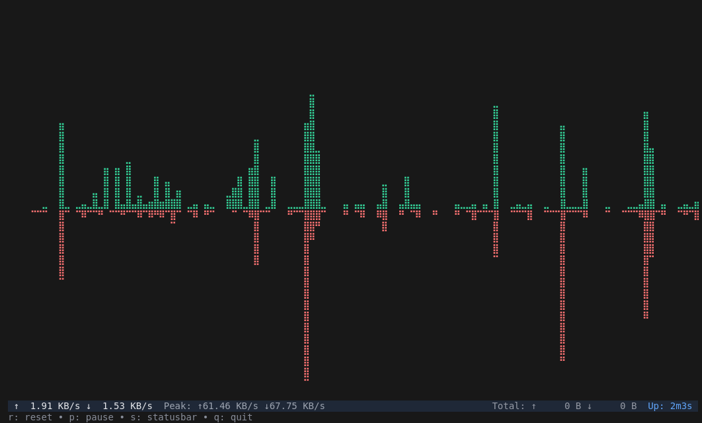
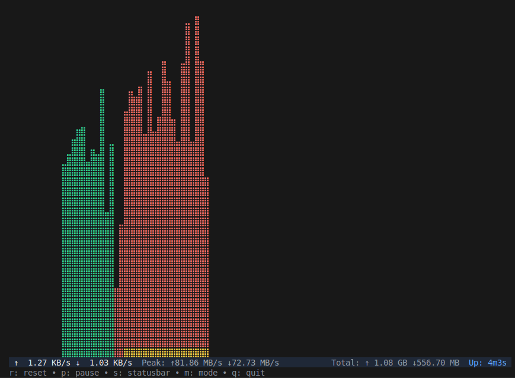

# 🏔️ PEAKS - Beautiful Terminal Bandwidth Monitor



_Split axis mode with upload below and download above the central axis_



_Overlay mode with both charts combined at the bottom, showing yellow overlap_

A modern, real-time bandwidth monitoring tool for your terminal with high-resolution braille charts and beautiful UI.

## Features

- 🚀 **Real-time monitoring** - Live bandwidth tracking with smooth updates
- 📊 **Beautiful charts** - High-resolution braille-based charts with dual display modes
- 🎨 **Modern UI** - Clean, colorful interface built with Charm TUI components
- 📈 **Detailed statistics** - Peak values, totals, and uptime tracking
- ⚡ **Performance optimized** - Efficient rendering and minimal CPU usage
- 🔧 **Interactive controls** - Pause, reset, and toggle features
- 🌐 **Cross-platform** - Works on Linux, macOS, and Windows
- 🎯 **Dual display modes** - Switch between split axis and overlay modes
- 🟡 **Smart overlap detection** - Yellow highlighting where upload and download overlap
- 📈 **Advanced scaling modes** - Linear, logarithmic, and square root scaling for better data visualization
- 🌈 **Gradient coloring** - Height-based color gradients make tall spikes lighter and more visually appealing

## 🚀 Installation

### Prerequisites

- A terminal with Unicode and color support

### Using Go (Recommended)

```bash
go install github.com/marcodenic/peaks@latest
```

### Manual Download

1. Go to [Releases](https://github.com/marcodenic/peaks/releases)
2. Download the binary for your platform
3. Make it executable: `chmod +x peaks-*`
4. Move to your PATH: `sudo mv peaks-* /usr/local/bin/peaks`

### Using Install Script

```bash
# Download and install using our install script
curl -sSL https://raw.githubusercontent.com/marcodenic/peaks/main/install.sh | bash
```

### Build from Source

```bash
git clone https://github.com/marcodenic/peaks
cd peaks
go build -o peaks
./peaks
```

## 🎮 Usage

Simply run the binary:

```bash
./peaks
```

### Controls

- **q** / **Ctrl+C** - Quit
- **p** / **Space** - Pause/Resume monitoring
- **r** - Reset chart and statistics
- **s** - Toggle statusbar visibility
- **m** - Toggle between split axis and overlay display modes
- **l** - Cycle through scaling modes (Linear → Logarithmic → Square Root)

### Scaling Modes

PEAKS offers three different scaling modes to help visualize your bandwidth data:

- **Linear** - Traditional linear scaling where chart height is proportional to bandwidth
- **Logarithmic** (default) - Logarithmic scaling that compresses large spikes while preserving detail for smaller values
- **Square Root** - Square root scaling that provides a middle ground between linear and logarithmic

The logarithmic scaling mode is particularly useful when you have occasional large bandwidth spikes that would otherwise make smaller bandwidth usage invisible on a linear scale. It ensures that both high and low bandwidth periods are clearly visible in the chart.

### Visual Enhancements

- **Gradient Coloring** - Chart segments become lighter as they get taller, creating a beautiful visual effect where the tallest spikes are the lightest
- **Height-based Shading** - Upload data uses a red gradient (dark red at bottom to light red at top) and download data uses a green gradient (dark green to light green)

## 📁 Project Structure

The project has been refactored into a clean, modular structure:

```
peaks/
├── cmd/peaks/           # Main application entry point
│   └── main.go         # Application setup and UI orchestration
├── internal/           # Internal packages (not importable externally)
│   ├── chart/          # Chart rendering functionality
│   │   └── braille.go  # Braille chart implementation
│   ├── monitor/        # Bandwidth monitoring
│   │   └── bandwidth.go # Cross-platform bandwidth monitoring
│   └── ui/             # UI components and utilities
│       └── components.go # UI components, stats, and formatters
├── old/                # Legacy single-file implementation
├── go.mod              # Go module definition
├── go.sum              # Go module checksums
├── Makefile            # Build automation
└── README.md           # This file
```

### Package Overview

- **cmd/peaks** - Main application entry point, handles UI orchestration and program flow
- **internal/chart** - Braille chart rendering with optimized performance
- **internal/monitor** - Cross-platform bandwidth monitoring using gopsutil
- **internal/ui** - UI components, statistics tracking, and formatting utilities

## 🛠️ Development

### Requirements

- Go 1.21 or later
- Compatible terminal with Unicode support for braille characters

### Building

```bash
# Development build
go build -o peaks ./cmd/peaks

# Production build with optimizations
go build -ldflags="-s -w" -o peaks ./cmd/peaks

# Cross-compilation
GOOS=linux GOARCH=amd64 go build -o peaks_linux ./cmd/peaks
GOOS=windows GOARCH=amd64 go build -o peaks.exe ./cmd/peaks
GOOS=darwin GOARCH=amd64 go build -o peaks_darwin ./cmd/peaks
```

### Running Tests

```bash
go test ./...
```

### Code Quality

```bash
go fmt ./...           # Format code
go vet ./...           # Vet code
golangci-lint run      # Run linter (requires golangci-lint)
```

## 🏗️ Architecture

### Design Principles

1. **Separation of Concerns** - Each package has a single responsibility
2. **Performance First** - Optimized rendering and minimal allocations
3. **Modularity** - Clean interfaces between components
4. **Testability** - Testable components with clear dependencies

### Key Components

- **BandwidthMonitor** - Handles cross-platform network statistics collection
- **BrailleChart** - Renders high-resolution charts using Unicode braille characters
- **UI Components** - Provides statistics tracking and formatting utilities
- **Main Application** - Orchestrates all components using Bubble Tea framework

## 📦 Dependencies

- [Bubble Tea](https://github.com/charmbracelet/bubbletea) - Modern TUI framework
- [Lipgloss](https://github.com/charmbracelet/lipgloss) - Styling and layout
- [Bubbles](https://github.com/charmbracelet/bubbles) - Common TUI components
- [gopsutil](https://github.com/shirou/gopsutil) - Cross-platform system monitoring
- [Teacup](https://github.com/mistakenelf/teacup) - Additional TUI components

## 🤝 Contributing

1. Fork the repository
2. Create a feature branch
3. Make your changes
4. Add tests if applicable
5. Submit a pull request

## 📄 License

This project is licensed under the MIT License - see the LICENSE file for details.

## 🙏 Acknowledgments

- Built with the amazing [Charm](https://charm.sh) TUI ecosystem
- Inspired by classic terminal monitoring tools
- Thanks to the Go community for excellent cross-platform libraries

- **Real-time Monitoring**: Monitor network bandwidth with high-resolution split-axis braille charts
- **Beautiful TUI**: Built with Bubble Tea and Lip Gloss for a modern terminal interface
- **Cross-platform**: Works on Linux, macOS, and Windows
- **Split-Axis Charts**: Clear separation with upload below and download above the axis line
- **Braille Charts**: High-resolution area charts using Unicode braille characters
- **Color Coding**:
  - 🔴 Red for upload traffic
  - 🟢 Green for download traffic
  - 🟡 Yellow for overlapping traffic (overlay mode only)
- **Interactive Controls**: Pause, reset, toggle stats, and more
- **Detailed Statistics**: Track uptime, peaks, and totals
- **Responsive Design**: Adapts to terminal size automatically
- **1-Minute+ History**: Shows bandwidth data for the full terminal width with dynamic history scaling

## 🚀 Installation

### Prerequisites

- Go 1.21 or higher
- A terminal with Unicode and color support

### Build from Source

```bash
git clone https://github.com/marcodenic/peaks
cd peaks
go build -o peaks
./peaks
```

## 🎮 Controls

| Key            | Action                              |
| -------------- | ----------------------------------- |
| `q` / `Ctrl+C` | Quit                                |
| `p` / `Space`  | Pause/Resume monitoring             |
| `r`            | Reset chart and statistics          |
| `s`            | Toggle statusbar                    |
| `m`            | Toggle display mode (split/overlay) |

## 🖥️ Screenshots

The tool offers two display modes:

### Split Axis Mode (Default)

- Upload data displayed below the central horizontal axis (red)
- Download data displayed above the central horizontal axis (green)
- Clear separation between upload and download traffic

### Overlay Mode

- Both upload and download charts displayed from the bottom axis
- Upload and download data overlaid on the same chart area
- Yellow highlighting where upload and download traffic overlap
- Press `m` to toggle between modes

Both modes display:

- Real-time bandwidth rates in the footer
- Optional statusbar with uptime, peaks, and totals
- Live/paused status indicator
- Always-visible mini-help with essential commands
- Beautiful color-coded interface with clear traffic separation

## 🛠️ Technical Details

### Built With

- **[Bubble Tea](https://github.com/charmbracelet/bubbletea)** - The Elm Architecture for Go TUI apps
- **[Lip Gloss](https://github.com/charmbracelet/lipgloss)** - Style definitions for terminal layouts
- **[Bubbles](https://github.com/charmbracelet/bubbles)** - Common UI components
- **[gopsutil](https://github.com/shirou/gopsutil)** - Cross-platform system information

### Architecture

- `main.go` - Main application and Bubble Tea model
- `bandwidth.go` - Cross-platform bandwidth monitoring
- `chart.go` - Braille chart rendering with color overlays
- `ui.go` - Enhanced UI components and statistics

### Chart Rendering

The tool uses Unicode braille characters (U+2800–U+28FF) for high-resolution terminal charts. Each character provides 8 dots in a 2×4 matrix, allowing for detailed visualization of bandwidth patterns.

### Color Mixing

When upload and download traffic overlap in the same chart position, the visualization intelligently blends colors to show yellow, indicating simultaneous activity.

## 🎨 Customization

The tool uses modern terminal colors and should work well with most terminal themes. Colors are automatically adapted based on your terminal's color support.

## 📊 Performance

- Updates at 2 FPS for smooth, easy-to-follow visualization
- Minimal CPU usage through efficient rendering
- Maintains 1 minute of history by default
- Automatic scaling based on observed peak values

## 🐛 Troubleshooting

### Braille Characters Not Displaying

- Ensure your terminal font supports Unicode braille characters
- Try fonts like: Cascadia Code, Fira Code, or DejaVu Sans Mono
- On Windows, use Windows Terminal or a modern terminal emulator

### Colors Not Showing

- Verify your terminal supports ANSI colors
- Modern terminals (Terminal.app, iTerm2, Windows Terminal) should work fine
- Legacy terminals may show limited colors

### Permission Issues

- The tool only reads network interface statistics
- No special permissions required on most systems
- If issues persist, try running as administrator/sudo

## 🤝 Contributing

We welcome contributions to Peaks! Please follow these guidelines:

### Development Setup

1. **Fork and Clone**

   ```bash
   git clone https://github.com/marcodenic/peaks
   cd peaks
   ```

2. **Install Dependencies**

   ```bash
   go mod tidy
   ```

3. **Build and Test**
   ```bash
   make build
   make test
   ```

### Code Style

- Follow standard Go conventions
- Run `go fmt` before committing
- Add tests for new features
- Update documentation as needed

### Submitting Changes

1. Create a feature branch
2. Make your changes
3. Test thoroughly
4. Submit a pull request

### Reporting Issues

Please use the GitHub issue tracker to report bugs or request features. Include:

- Your operating system and terminal
- Go version
- Steps to reproduce the issue
- Expected vs actual behavior

## 📜 License

This project is licensed under the MIT License - see the [LICENSE](LICENSE) file for details.

## 🙏 Acknowledgments

- The amazing [Charm](https://charm.sh) team for the beautiful TUI libraries
- The Go community for excellent cross-platform system libraries
- Terminal art enthusiasts who pioneered braille-based visualization

---

_Made with ❤️ and lots of ☕_
