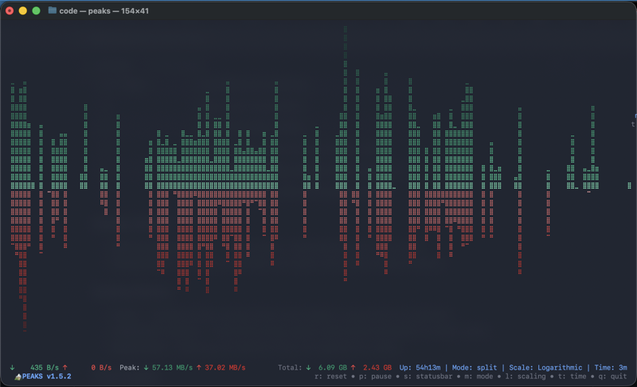
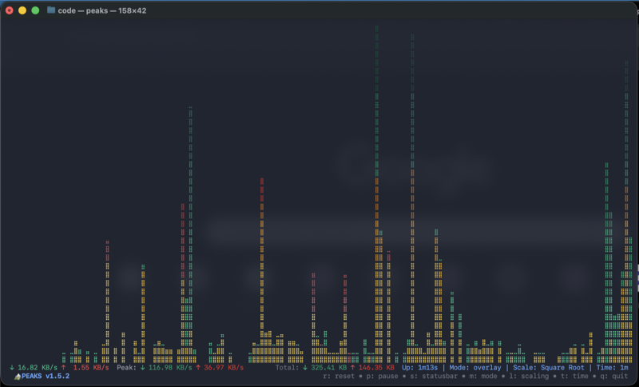
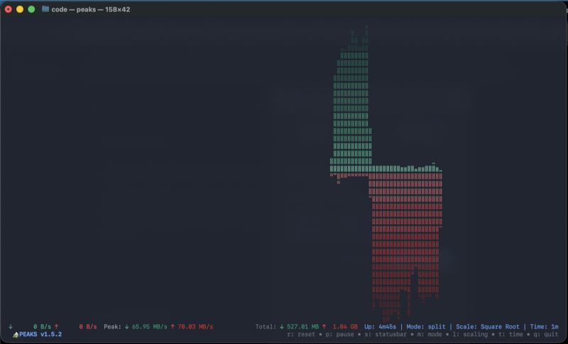
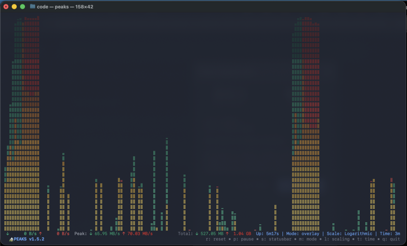
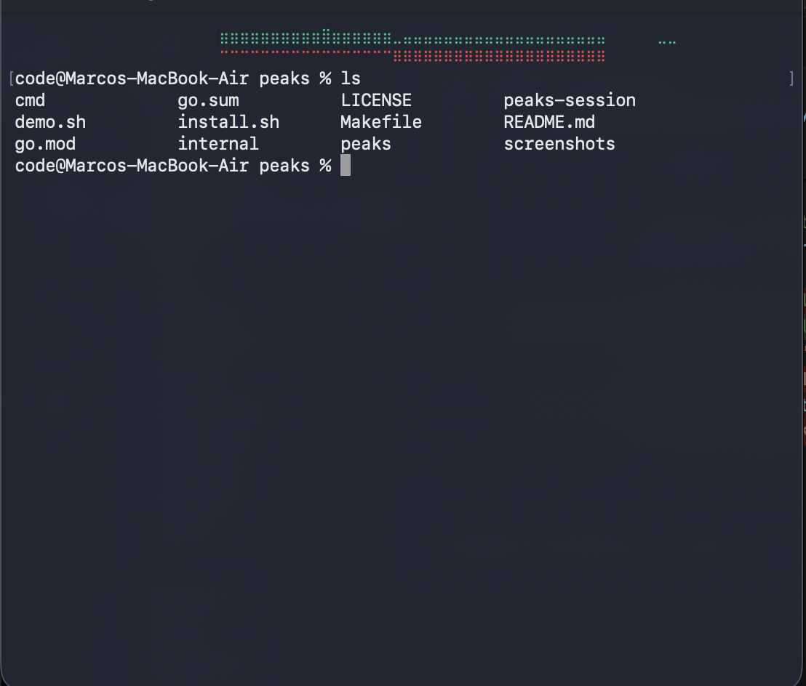

# 🏔️ PEAKS - Beautiful Terminal Bandwidth Monitor

<table>
  <tr>
    <td align="center">
      
      <br/>
      <em>Split Axis Mode (default)</em>
    </td>
    <td align="center">
      
      <br/>
      <em>Overlay Mode (--overlay)</em>
    </td>
  </tr>
  <tr>
    <td align="center">
      
      <br/>
      <em>Split Axis Mode</em>
    </td>
    <td align="center">
      
      <br/>
      <em>Overlay Mode</em>
    </td>
  </tr>
  <tr>
    <td colspan="2" align="center">
      
      <br/>
      <em>Compact Mode (--compact)</em>
    </td>
  </tr>
</table>

A modern, real-time bandwidth monitoring tool for your terminal with high-resolution braille charts and beautiful UI.

## Features

- 🚀 **Real-time monitoring** - Live bandwidth tracking with smooth updates
- 📊 **Beautiful charts** - High-resolution braille-based charts with dual display modes
- 🎨 **Modern UI** - Clean, colorful interface built with Charm TUI components
- 📈 **Detailed statistics** - Peak values, totals, and uptime tracking
- ⚡ **Performance optimized** - Efficient rendering and minimal CPU usage
- 🔧 **Interactive controls** - Pause, reset, and toggle features
- 🌐 **Cross-platform** - Works on Linux, macOS, and Windows
- 🎯 **Dual display modes** - Switch between split axis and overlay modes
- 📈 **Advanced scaling modes** - Linear, logarithmic, and square root scaling for better data visualization
- 🌈 **Gradient coloring** - Height-based color gradients
- ⏱️ **Flexible time scales** - Adjustable history from 1 to 60 minutes
- 📐 **Compact mode** - Minimal 2-line header display for always-on monitoring

## 🎮 Usage

### Full-Screen Mode

Simply run the binary for the full interactive experience:

```bash
./peaks
```

### Compact Mode

Run as a persistent header display at the top of your terminal:

```bash
./peaks --compact
```

Compact mode creates a minimal 2-line bandwidth chart at the top of your terminal, allowing you to continue using your shell while monitoring network activity in real-time. The chart automatically fills the full terminal width and resizes dynamically.

**Compact Mode Options:**

```bash
./peaks --compact                    # Basic 2-line compact mode
./peaks --compact --overlay          # Use overlay mode (both graphs from bottom)
./peaks --compact --time 5           # Show 5 minutes of history
./peaks --compact --size 3           # Use 3 lines instead of 2
```

Available flags:
- `--compact` - Enable compact mode
- `--overlay` - Use overlay display mode
- `--time N` - Set time window (1, 5, 10, 30, or 60 minutes)
- `--size N` - Set chart height in lines (default: 2)

To stop compact mode, use `Ctrl+C` or find and kill the background process:
```bash
pkill peaks
```

### Controls

| Key                    | Action                                         |
| ---------------------- | ---------------------------------------------- |
| `q` / `Esc` / `Ctrl+C` | Quit                                           |
| `p` / `Space`          | Pause/Resume monitoring                        |
| `r`                    | Reset chart and statistics                     |
| `s`                    | Toggle statusbar visibility                    |
| `m`                    | Toggle between split axis and overlay modes    |
| `l`                    | Cycle through scaling modes (Linear → Log → √) |
| `t`                    | Cycle time scale (1/3/5/10/15/30/60 minutes)   |

### Display Modes

- **Split Axis Mode** (default) - Upload below, download above the central axis
- **Overlay Mode** - Both charts overlaid from bottom with yellow overlap indication

### Scaling Modes

- **Linear** - Traditional linear scaling where chart height is proportional to bandwidth
- **Logarithmic** (default) - Compresses large spikes while preserving detail for smaller values
- **Square Root** - Middle ground between linear and logarithmic scaling

### Time Scales

Choose from 1, 3, 5, 10, 15, 30, or 60 minutes of history display. The tool always maintains up to 60 minutes of data internally.

## � Installation

### Prerequisites

- A terminal with Unicode and color support

### Using Go (Recommended)

```bash
go install github.com/marcodenic/peaks/cmd/peaks@latest
```

### Manual Download

1. Go to [Releases](https://github.com/marcodenic/peaks/releases)
2. Download the binary for your platform
3. Make it executable: `chmod +x peaks-*`
4. Move to your PATH: `sudo mv peaks-* /usr/local/bin/peaks`

### Using Install Script

```bash
# Download and install using our install script
curl -sSL https://raw.githubusercontent.com/marcodenic/peaks/main/install.sh | bash
```

### Build from Source

```bash
git clone https://github.com/marcodenic/peaks
cd peaks
go build -o peaks ./cmd/peaks
./peaks
```

The project has been refactored into a clean, modular structure:

```
peaks/
├── cmd/peaks/           # Main application entry point
│   └── main.go         # Application setup and UI orchestration
├── internal/           # Internal packages (not importable externally)
│   ├── chart/          # Chart rendering functionality
│   │   └── braille.go  # Braille chart implementation
│   ├── monitor/        # Bandwidth monitoring
│   │   └── bandwidth.go # Cross-platform bandwidth monitoring
│   └── ui/             # UI components and utilities
│       └── components.go # UI components, stats, and formatters
├── go.mod              # Go module definition
├── go.sum              # Go module checksums
├── Makefile            # Build automation
└── README.md           # This file
```

### Package Overview

- **cmd/peaks** - Main application entry point, handles UI orchestration and program flow
- **internal/chart** - Braille chart rendering with optimized performance
- **internal/monitor** - Cross-platform bandwidth monitoring using gopsutil
- **internal/ui** - UI components, statistics tracking, and formatting utilities

## 🛠️ Development

### Requirements

- Go 1.21 or later
- Compatible terminal with Unicode support for braille characters

### Building

```bash
# Development build
go build -o peaks ./cmd/peaks

# Production build with optimizations
go build -ldflags="-s -w" -o peaks ./cmd/peaks

# Cross-compilation
GOOS=linux GOARCH=amd64 go build -o peaks_linux ./cmd/peaks
GOOS=windows GOARCH=amd64 go build -o peaks.exe ./cmd/peaks
GOOS=darwin GOARCH=amd64 go build -o peaks_darwin ./cmd/peaks
```

### Running Tests

```bash
go test ./...
```

### Code Quality

```bash
go fmt ./...           # Format code
go vet ./...           # Vet code
golangci-lint run      # Run linter (requires golangci-lint)
```

## 🏗️ Architecture

### Design Principles

1. **Separation of Concerns** - Each package has a single responsibility
2. **Performance First** - Optimized rendering and minimal allocations
3. **Modularity** - Clean interfaces between components
4. **Testability** - Testable components with clear dependencies

### Key Components

- **BandwidthMonitor** - Handles cross-platform network statistics collection
- **BrailleChart** - Renders high-resolution charts using Unicode braille characters
- **UI Components** - Provides statistics tracking and formatting utilities
- **Main Application** - Orchestrates all components using Bubble Tea framework

## 📦 Dependencies

- [Bubble Tea](https://github.com/charmbracelet/bubbletea) - Modern TUI framework
- [Lipgloss](https://github.com/charmbracelet/lipgloss) - Styling and layout
- [Bubbles](https://github.com/charmbracelet/bubbles) - Common TUI components
- [gopsutil](https://github.com/shirou/gopsutil) - Cross-platform system monitoring
- [Teacup](https://github.com/mistakenelf/teacup) - Additional TUI components

## 🤝 Contributing

1. Fork the repository
2. Create a feature branch
3. Make your changes
4. Add tests if applicable
5. Submit a pull request

## 📄 License

This project is licensed under the MIT License - see the LICENSE file for details.

## 🙏 Acknowledgments

- Built with the amazing [Charm](https://charm.sh) TUI ecosystem
- Inspired by classic terminal monitoring tools
- Thanks to the Go community for excellent cross-platform libraries

---

_Made with ❤️ and lots of ☕_
